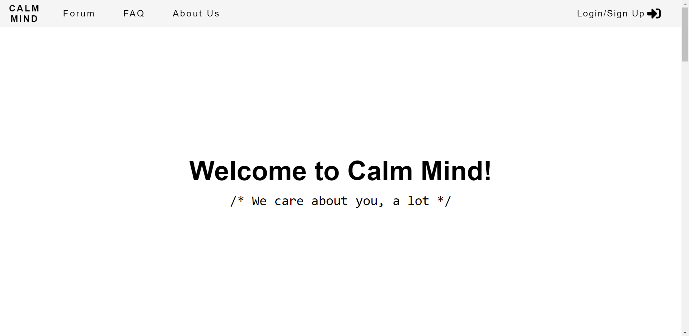

# Calm Mind

#### <u>Open Category</u>

Team members: 

1. Ashley Ooi Yan-Lin 
2. Tan Eng Teck 
3. Lim Ke An 
4. Shamrethan Balendran

#### Project background

Due to the current pandemic situation, more people are suffering from mental health illnesses. Even before the pandemic, about <u>30% of population in Malaysia</u> suffered from anxiety and/or depression. 

Here some of the statistics of mental health of adolescents in Malaysia:

- 1 in 5 adolescents are depressed
- 2 in 5 adolescents are anxious
- 1 in 10 adolescents are stressed

According to the statistics, it can be said that mental health is an issue in Malaysia. Therefore, our team aim to reduce the number of people mainly adolescents suffering from mental health illnesses. 

#### Theme: Mental Health

#### Product Name: Calm Mind

**CALM MIND** is an interactive platform opened to all students with the aim of motivating students when times are hard as well as forming a new community based on the topic of the day. Through this platform, students are free to share their interests, ideas and current thoughts with other students. Our team hope that by providing a space for students to express their current thoughts and feelings while encourage engagement between them, it will bring down the number of adolescents suffering from mental health illnesses. 

Besides that, Word Cloud is a feature where students are able to enter their current feeling as a keyword. The more the keyword is being entered, the larger the keyword will display. A frequently asked question (FAQ) page is provided if new users have any common queries regarding **CALM MIND**. Our platform have a total of 6 pages which are the *home page*, forum page, *FAQ page*, *About Us page*, *login page* and a *chat discussion page* which can be found at the bottom right of the forum page. 

Features Highlight

- Everyday, a simple question will be posted
- everything can be answered anonymously
- the next day, a forum will be open and a hashtag feature will be introduced to post the relevant picture

##### To run the website:

The main folder contains all the required file to run the application. The directory to the homepage is `__dirname/src/index.html`

The main page looks like:

